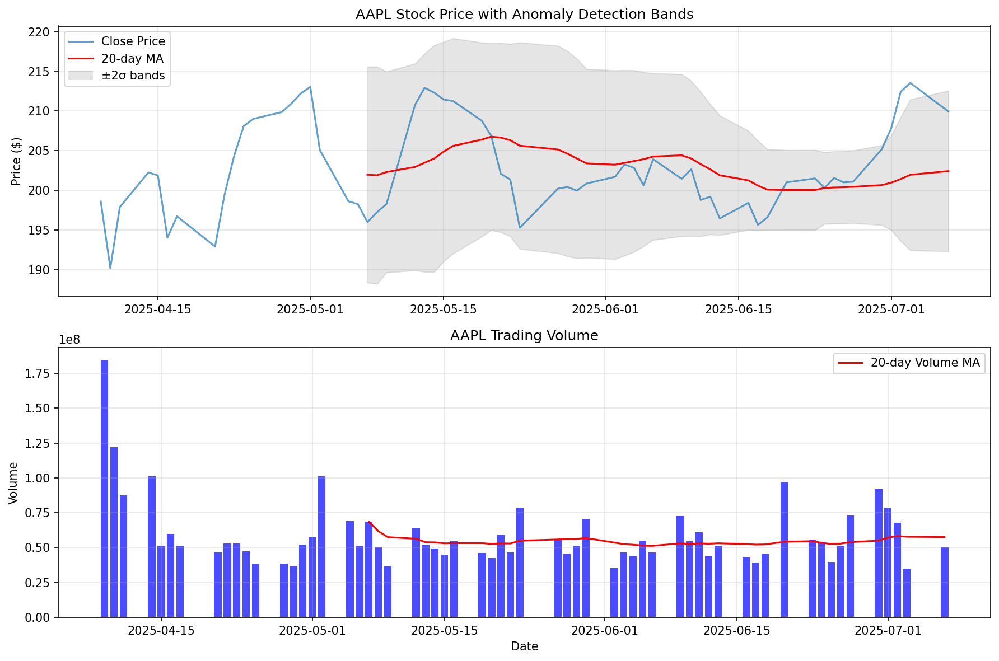

# Real-time Stock Price Anomaly Detector

A comprehensive Python application that monitors stock prices in real-time and detects unusual patterns using multiple AI/ML techniques including statistical analysis, volume analysis, and LSTM neural networks.

## 🎯 Project Overview

This project demonstrates advanced software engineering and machine learning skills by implementing:

- **AI/ML Techniques**: Statistical analysis, moving averages, LSTM neural networks
- **Real-time Processing**: Continuous monitoring with configurable intervals
- **Modular Architecture**: Clean separation of concerns with multiple detection methods
- **Critical Thinking**: Smart anomaly definition considering market context
- **Problem Solving**: Handles API rate limits, missing data, and edge cases

## 🏗️ System Architecture

```
┌─────────────────┐    ┌──────────────────┐    ┌─────────────────┐
│   API Client    │────│  Data Validator  │────│   Data Storage  │
└─────────────────┘    └──────────────────┘    └─────────────────┘
         │                       │                       │
         │                       ▼                       │
         │              ┌──────────────────┐             │
         │              │ Anomaly Detectors│             │
         │              │ • Statistical    │             │
         │              │ • Volume         │             │
         │              │ • LSTM           │             │
         │              └──────────────────┘             │
         │                       │                       │
         ▼                       ▼                       ▼
┌─────────────────┐    ┌──────────────────┐    ┌─────────────────┐
│ Main Orchestrator│────│  Alert System   │────│    Reporting    │
└─────────────────┘    └──────────────────┘    └─────────────────┘
```

## 🚀 Features

### Anomaly Detection Methods

1. **Statistical Anomaly Detection**

   - Moving averages and standard deviation
   - Z-score calculation for price deviations
   - Configurable thresholds and window sizes

2. **Volume Anomaly Detection**

   - Unusual trading volume patterns
   - Separate thresholds for volume spikes
   - Context-aware volume analysis

3. **LSTM Neural Network**
   - Deep learning for pattern recognition
   - Time series prediction
   - Learns complex market patterns

### Key Features

- **Real-time Monitoring**: Continuous price tracking with configurable intervals
- **Multi-stock Support**: Monitor multiple stocks simultaneously
- **Smart Rate Limiting**: Handles API constraints gracefully
- **Data Persistence**: SQLite database for historical data and alerts
- **Comprehensive Alerting**: Console, email, and database alerts
- **Robust Error Handling**: Graceful handling of API failures and data issues
- **Configurable Thresholds**: Easily adjustable sensitivity settings

## 📋 Requirements

- Python 3.8+
- Internet connection for stock data
- At least 4GB RAM (for LSTM training)

## 🛠️ Installation

1. **Clone or download the project files**

2. **Install dependencies**:

   ```bash
   pip install -r requirements.txt
   ```

3. **Configure the system** (optional):
   - Edit `config.json` to customize:
     - Stock symbols to monitor
     - Monitoring intervals
     - Detection thresholds
     - Email notifications

## 🚀 Usage

### Basic Usage

```bash
python stock_anomaly_detector.py
```

The system will:

1. Load historical data for configured stocks
2. Train the ML models
3. Start real-time monitoring
4. Display anomalies in the console
5. Save all data to SQLite database

### Configuration Options

Edit `config.json` to customize:

```json
{
  "symbols": ["AAPL", "GOOGL", "MSFT", "TSLA", "AMZN"],
  "monitoring_interval": 300, // 5 minutes
  "training_period": "1y", // 1 year of historical data
  "statistical_detector": {
    "window_size": 20,
    "threshold_multiplier": 2.0
  }
}
```

### Understanding Anomalies

The system detects several types of anomalies:

- **PRICE_SPIKE**: Unusual price increases
- **PRICE_DROP**: Unusual price decreases
- **VOLUME_SPIKE**: Abnormal trading volume
- **LSTM_PATTERN_ANOMALY**: Complex pattern deviations

Each anomaly includes:

- Severity level (HIGH/MEDIUM)
- Confidence score
- Expected vs actual values
- Detailed explanation

## 📊 Sample Output

```
🚨 ANOMALY ALERT - HIGH SEVERITY
================================================================================
Symbol: AAPL
Time: 2025-01-15 10:30:00
Type: PRICE_SPIKE
Current Price: $185.50
Expected Range: $175.20 - $182.80
Confidence: 85.4%
Details: Z-score: 3.2, Moving average: $179.00
================================================================================
```

## 🏛️ Project Structure

```
stock_anomaly_detector/
├── stock_anomaly_detector.py    # Main application
├── config.json                  # Configuration file
├── requirements.txt             # Dependencies
├── README.md                    # This file
├── stock_anomaly_detector.log   # Generated log file
└── stock_anomaly_detector.db    # Generated SQLite database
```

## 🧠 Technical Implementation

### Data Pipeline

1. **Data Acquisition**: Yahoo Finance API via yfinance
2. **Data Validation**: Clean missing values, outliers, duplicates
3. **Feature Engineering**: Calculate moving averages, volume ratios
4. **Model Training**: Train statistical and LSTM models
5. **Real-time Analysis**: Continuous anomaly detection
6. **Alert Generation**: Multi-channel notification system

### Machine Learning Details

**Statistical Model**:

- Uses rolling windows for moving averages
- Z-score calculation for deviation measurement
- Configurable threshold multipliers

**LSTM Model**:

- 30-day sequence prediction
- 2-layer LSTM with dropout
- Min-max scaling for normalization
- Percentile-based threshold setting

**Volume Analysis**:

- Separate statistical analysis for volume
- Higher thresholds for volume anomalies
- Context-aware volume spike detection

## 🔧 Advanced Usage

### Custom Detectors

Add your own anomaly detection methods by extending the `AnomalyDetector` class:

```python
class CustomAnomalyDetector(AnomalyDetector):
    def train(self, data: pd.DataFrame):
        # Implement training logic
        pass

    def detect_anomalies(self, data: pd.DataFrame, current_price: float):
        # Implement detection logic
        return anomalies
```

### Database Queries

Access stored data directly:

```python
import sqlite3
conn = sqlite3.connect('stock_anomaly_detector.db')

# Get recent anomalies
recent_anomalies = pd.read_sql_query('''
    SELECT * FROM anomaly_alerts
    WHERE datetime(timestamp) >= datetime('now', '-1 day')
''', conn)
```

## 📈 Performance Considerations

- **Memory Usage**: LSTM models require ~500MB per symbol
- **API Limits**: Built-in rate limiting (1 request/second default)
- **Training Time**: Initial training takes 2-5 minutes per symbol
- **Real-time Performance**: Analysis completes in <1 second per symbol

## 🛡️ Error Handling

The system handles various error conditions:

- Network connectivity issues
- API rate limit violations
- Missing or corrupt data
- Model training failures
- Database connection problems

All errors are logged with appropriate severity levels.

## 🔮 Future Enhancements

Potential improvements:

1. **Additional Data Sources**: Integrate news sentiment, social media
2. **More ML Models**: Random Forest, SVM, ensemble methods
3. **Advanced Alerts**: Telegram, Slack, webhook notifications
4. **Web Dashboard**: Real-time visualization interface
5. **Portfolio Integration**: Track portfolio-specific anomalies
6. **Backtesting**: Historical performance analysis

## 📝 Academic Skills Demonstrated

This project showcases:

### AI/ML Skills

- Time series analysis and forecasting
- Deep learning with LSTM networks
- Statistical modeling and hypothesis testing
- Feature engineering and data preprocessing

### Software Engineering

- Object-oriented design patterns
- Modular architecture and separation of concerns
- Error handling and logging
- Configuration management
- Database design and ORM

### Critical Thinking

- Anomaly definition in financial contexts
- Market regime consideration
- False positive minimization
- Risk assessment and severity scoring

### Problem Solving

- API rate limit management
- Real-time data processing
- Memory-efficient model training
- Robust error recovery

## 📚 References

- [Yahoo Finance API Documentation](https://pypi.org/project/yfinance/)
- [LSTM for Time Series Prediction](https://keras.io/examples/timeseries/)
- [Statistical Anomaly Detection Methods](https://en.wikipedia.org/wiki/Anomaly_detection)

## 🌐 Streamlit Web Dashboard

A modern, interactive web dashboard is included for real-time visualization and control.

### Features

- **Live Stock Monitoring**: Select stocks and see real-time price and anomaly updates.
- **Multiple Anomaly Detection Methods**: Choose between statistical, LSTM, and volume spike detection.
- **Advanced Visualizations**: Interactive Plotly candlestick charts with anomaly markers and moving averages.
- **Explainable AI**: Expandable explanations for each detected anomaly.
- **Auto-Refresh**: Set your preferred refresh interval for live updates.
- **User Controls**: Adjust detection sensitivity and methods from the sidebar.

### How to Run

1. Install dependencies (if not already):
   ```bash
   pip install -r requirements.txt
   ```
2. Start the dashboard:
   ```bash
   streamlit run dashboard.py
   ```
3. Open the provided local URL (usually http://localhost:8501/) in your browser.

### Example Screenshot



---
